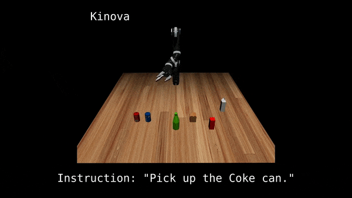

# MujocoRobots



This is the simulator used in the CoRL 2022 paper "[Modularity through Attention: Efficient Training and Transfer of Language-Conditioned Policies for Robot Manipulation](http://languageforrobots.com/)"


# Setup
This simulator is based on Mujoco (the simulator engine) and mujoco-py (the bridge between python and mujoco). In order to use OSC controller, we use the mujoco-py from abr_control. Please install the following packages in order to ensure the simulator is runnable.
- mujoco200
- mujoco210
- abr_control
- mujoco-py (from abr_control)

# Collecting Data
## Collect Demonstrations for UR5
```
python collect_data_ur5.py
```

## Collect Demonstrations for Jaco2
```
python collect_data_jaco2.py
```

## Collect Demonstrations for Panda
```
python collect_data_panda.py
```